# 🍔 Food Delivery Backend — Spring Boot Microservices

A production-grade **food delivery backend** built with **Spring Boot**, **PostgreSQL**, **Redis**, **Kafka**, **Docker**, and **Spring Cloud**.

It demonstrates real-world microservices patterns:
- Independent services with **synchronous REST** (RestTemplate) and **asynchronous Kafka** events
- **JWT + Google OAuth2** + OTP authentication
- **Google Maps**–driven delivery partner assignment & nearest address detection
- **Razorpay** payments (initiate, verify, refund, retry)
- **Notifications** via Email, **FCM** push, and **Twilio** SMS
- **Redis** caching + distributed locks for atomic partner assignment
- **API Gateway**, **Service Registry (Eureka)**, **Config Server**

### 🛠️ Setup & Installation:
## 1️⃣ Prerequisites
- Java 17+ (Temurin/OpenJDK)
- Maven 3.8+
- Docker & Docker Compose
- PostgreSQL, Redis, Kafka, Zookeeper (if not using Docker)
- Google Cloud Project (Maps + OAuth credentials)
- Razorpay Account
- Firebase Project
- Twilio Account

## 2️⃣ Clone Repository
git clone https://github.com/your-username/food-delivery-backend.git
cd food-delivery-backend

## 3️⃣ Run Services
cd auth-service
mvn clean install
mvn spring-boot:run
- run all service

## 4️⃣ Verify Endpoints
- Gateway → http://localhost:7083
- You can add swagger to get apis list.
---

## 🚀 Tech Stack

| Layer / Purpose       | Technology |
|-----------------------|------------|
| Backend Framework     | Spring Boot, Spring Cloud |
| Database              | PostgreSQL |
| Cache & Locks         | Redis |
| Messaging             | Apache Kafka + Zookeeper |
| Containerization      | Docker / Docker Compose |
| Authentication        | JWT, Google OAuth2, OTP |
| Notifications         | FCM, Twilio SMS, SMTP/Email |
| Maps & GPS            | Google Maps API |
| Gateway               | Spring Cloud Gateway |
| Service Discovery     | Spring Cloud Eureka |
| Config Server         | Spring Cloud Config |

---

## 📦 Microservices Overview

| Service | Branch | Port | Description |
|---------|--------|------|-------------|
| Auth Service | [Link](https://github.com/udit-166/Food-Delivery-Backend/tree/auth-service) | 7080 | Auth, JWT, Google OAuth, OTP, Address Book |
| Restaurant Service | [Link](https://github.com/udit-166/Food-Delivery-Backend/tree/restaurant-service) | 7081 | Restaurant/Category/Food CRUD & Search |
| Order Service | [Link](https://github.com/udit-166/Food-Delivery-Backend/tree/order-service) | 7082 | Orders, Payments, Ratings, Kafka Listeners |
| Cart & Delivery | [Link](https://github.com/udit-166/Food-Delivery-Backend/tree/delivery-and-cart-service) | 7084 | Cart Ops, Delivery Partner Assignment, Redis Lock |
| Notification Service | [Link](https://github.com/udit-166/Food-Delivery-Backend/tree/notification-service) | 7085 | Email, SMS, Push Notifications |
| API Gateway | [Link](https://github.com/udit-166/Food-Delivery-Backend/tree/service-api-gateway) | 7083 | Central Routing & JWT Validation |
| Service Registry | [Link](https://github.com/udit-166/Food-Delivery-Backend/tree/service-registration) | 8761 | Eureka Service Discovery |
| Config Server | [Link](https://github.com/udit-166/Food-Delivery-Backend/tree/service-config) | 8888 | Central Config Management |

---
## 📦 Microservices & Responsibilities

### 1) **auth-service**
- Login/register (phone OTP & Google)
- JWT token (issue/refresh), role retrieval
- Address book (current address via GPS → nearest saved address default)
- Exposed methods (high-level):  
  `login`, `register`, `findByGoogleId`, `refreshToken`, `generateOtp`, `sendOtp`, `getOtp`, `validateOtp`,  
  `findUserByPhoneNumberOrEmail`, `updateuserProfile`, `getUserRole`,  
  `getCurrentaddress`, `getAllAddressOfUser`, `saveAddress`, `updatedAddress`,  
  `updateUserMetaDataInfo`, `deActivateUser`.
- Branch Link: [Auth-Service-Branch](https://github.com/udit-166/Food-Delivery-Backend/tree/auth-service).

**Depends on**: Google OAuth; Notification (OTP/email).  
**Used by**: All services through Gateway for authN/authZ.

---

### 2) **restaurant-service** (restaurant, common, category, food)
- Restaurant CRUD; open/close
- Category CRUD
- Food catalog CRUD; submit ratings
- Menu retrieval per restaurant; **search** (restaurant → category → food fallback)
- Methods include:  
  `newCategories`, `updateCategories`, `addFoodItems`, `getAllFoodItems`,  
  `getAllFoodItemOfRestaurant`, `getAllFoodItemOfCategory`, `getFoodItem`,  
  `updateFoodItem`, `deleteFoodItem`, `submitFoodRating`,  
  `createRestaurant`, `getAllRestaurant`, `updateRestaurant`, `deleteRestaurant`,  
  `getMenuOfRestaurant`, `makeCloseOrOpenRestaurant`, `search`.
- Branch Link: [Restaurant-Service-Branch](https://github.com/udit-166/Food-Delivery-Backend/tree/restaurant-service)

**Depends on**: Auth (owner/roles).  
**Used by**: Order (menu validation), Cart & Delivery (restaurant location).

---

### 3) **order-service** (order, payment)
- Place/track/cancel orders; status lifecycle
- Counts & summaries; review pending lookups
- Payment flows (Razorpay): `initiatePayment`, `verifyPayment`, `refundPayment`, `retryPayment`  
- Earnings & payment listings
- Kafka listeners: order status updates
- Methods include:  
  `orderSummary`, `placeOrder`, `getOrderById`, `getOrderByCustomerId`, `getOrderByRestaurantId`,  
  `updateOrderStatus`, `cancelOrder`, `requestCancellationOfOrder`, `trackOrder`,  
  `countOrderByCustomerId`, `countOrderByRestaurantId`,  
  `updateOrderRatingDetails`, `getLastFiveDaysReviewPending`,  
  `listenOrderStatusUpdate`, plus all payment APIs listed above.
- Branch Link: [Order-Service-Branch](https://github.com/udit-166/Food-Delivery-Backend/tree/order-service)

**Depends on**: Restaurant (menu/price validation), Cart & Delivery (assignment/status), Notification (events), Auth (user).  
**Used by**: Notification; Cart & Delivery.

---

### 4) **notification-service**
- Email, FCM push, Twilio SMS
- OTP generation/sending (can be delegated from auth-service)
- Order/payment lifecycle notifications:  
  `handleOrderPlaced`, `handleOrderDispatched`, `handleOrderAssignedToDeliveryPerson`,  
  `handleOrderDilveredNotification`, `handlePaymentFailedNotification`, `handlePaymentSuccessNotification`.
- Branch Link: [Notification-Service-Branch](https://github.com/udit-166/Food-Delivery-Backend/tree/notification-service)

**Depends on**: Auth (user contacts), Order (events).  
**Used by**: All services via events/HTTP when notifications are needed.

---

### 5) **cart-and-delivery-service**
- Cart: `addOrUpdateItem`, `getCart`, `removeItem`, `clearCart`
- Delivery partner geo-search (lat/lng + radius) and ETA from Google
- Atomic assignment with Redis lock: `tryAtomicAssignDeliveryPartner`, `acquireLocked`, `releaseLock`
- Delivery lifecycle: `assignDeliveryPerson`, `updateStatus`, `getDeliveryDetailsById`
- Reviews: `getReviewsByDeliveryId`, `submitReviewForDelivery`
- Branch Link: [Delivery-Service-Branch](https://github.com/udit-166/Food-Delivery-Backend/tree/delivery-and-cart-service)

**Depends on**: Google Maps (nearby partners & ETA), Restaurant (location), Auth (partner identity).  
**Used by**: Order (assignment & status), Notification (events).

---

### 6) **service-api-gateway**
- Central routing & JWT validation (and recommended: rate-limiting & CORS)

** Branch Link **: [Api-Gateway_Branch](https://github.com/udit-166/Food-Delivery-Backend/tree/service-api-gateway)

### 7) **service-registry**
- Eureka-based service discovery
** Branch Link **: [Service-Registration-Branch](https://github.com/udit-166/Food-Delivery-Backend/tree/service-registration)
### 8) **service-config**
- Centralized config (use env vars or Vault for secrets)
** Branch Link **: [Service-Config-Branch](https://github.com/udit-166/Food-Delivery-Backend/tree/service-config)
---

## 🔗 Inter-Service Dependencies (Bidirectional Where Applicable)

## 🧭 High-Level System Architecture

## 🔐 Auth Flow (Google OAuth or OTP)

## 💳 Order + Payment Flow

## 🚚 Delivery Assignment + Status Flow

```mermaid
sequenceDiagram
    participant ORDER as order-service
    participant CART as cart-and-delivery-service
    participant G as Google Maps
    participant RD as Redis
    participant KAFKA as Kafka
    participant NOTI as notification-service
    participant U as User

    ORDER->>CART: Request Delivery Assignment
    CART->>G: Nearby partners + ETA
    CART->>RD: Acquire lock(orderId)
    CART->>CART: If partner available → tryAtomicAssignDeliveryPartner()
    CART->>KAFKA: Publish OrderAssigned(partner)
    CART-->>ORDER: Assigned + ETA
    CART->>CART: If no partner → retry with larger radius
    KAFKA->>NOTI: Consume OrderAssigned
    NOTI->>ORDER: Ack (optional)
    NOTI->>U: Rider assigned
    CART->>KAFKA: Publish OrderDispatched
    KAFKA->>NOTI: Consume OrderDispatched
    NOTI->>U: Your order is on the way
    CART->>KAFKA: Publish OrderDelivered
    KAFKA->>NOTI: Consume OrderDelivered
    NOTI->>U: Order delivered — Please rate


```

---

## 🛠️ Future Roadmap

### **1) Customer-Care-Service**
Planned as a separate microservice to handle:
- 24/7 customer support tickets
- Live chat with support agents
- Automated complaint categorization & escalation
- Refund & dispute management
- Order modification requests before dispatch

### **2) Recommendation Engine**
- Personalized restaurant & dish suggestions using purchase history
- Collaborative filtering and content-based recommendation models
- Real-time trending food detection
- Seasonal and location-based offers

### **3) AI Chatbot**
- AI-powered virtual assistant to handle common queries
- Order status lookup & cancellation via natural language
- Personalized food discovery
- Multilingual support for better accessibility

---

These additions will further enhance the **Food Delivery Backend** into a complete, production-grade, industry-standard platform,  
equipped with intelligent personalization, automated support, and advanced customer experience tools.

---

💡 *These are the overall backend industry-level capabilities. Hopefully, going through this project helps you learn a lot and build your own full production-ready food delivery backend!*
